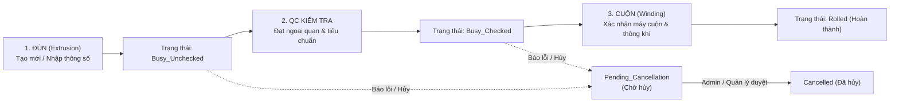

# AI_CONTEXT.md - Tổng Quan & Hướng Dẫn Vận Hành Dự Án WEB_BOBIN

Tài liệu này cung cấp toàn bộ bức tranh kiến trúc, luồng nghiệp vụ nhà máy, quy tắc code và các quy chuẩn quan trọng của dự án **WEB_BOBIN** nhằm giúp AI nắm bắt tức thì bối cảnh làm việc mà không cần phân tích lại từ đầu.

---

## 1. Tổng Quan Dự Án & Công Nghệ

- **Mục đích:** Hệ thống Web App quản lý quy trình sản xuất, kiểm tra chất lượng (QC), lưu trữ và cuộn Bobin trong nhà xưởng (Nhà xưởng đùn nhựa - SMC Factory).
- **Môi trường hoạt động:** Chạy Local Intranet / Server XAMPP (Apache + MariaDB/MySQL + PHP 8.2+).
- **Kiến trúc phần mềm:** Mô hình MVC (Model - View - Controller / Repository - Service pattern thuần, không dùng framework nặng như Laravel/Symfony).
  - **Routing:** Front Controller qua `public/index.php?url=controller/method`. Router phân giải request và mapping controller.
  - **Database Access:** Singleton PDO qua `Database::getInstance()->pdo()`.
  - **i18n (Đa ngôn ngữ):** Hỗ trợ 3 ngôn ngữ: Tiếng Việt (`vi`), Tiếng Anh (`en`), Tiếng Nhật (`ja`).
    - Backend: `Language::getInstance()`, helper `__('key')`.
    - Frontend: `public/assets/js/i18n.js` với attribute `data-i18n="key"` và hàm `window.t('key')`.
  - **Session & Quyền hạn (Roles):**
    - `extrusion`: Nhân viên nhóm Đùn.
    - `qc`: Nhân viên kiểm tra chất lượng (QC).
    - `winding`: Nhân viên nhóm Cuộn.
    - `admin`: Quản trị viên (quản lý nhân viên, cấu hình hệ thống).

---

## 2. Quy Trình Vận Hành Sản Xuất (Bobin Lifecycle)

Quy trình sản xuất Bobin trải qua 4 công đoạn cốt lõi theo thứ tự:

### Chi tiết các công đoạn:

1. **Nhóm Đùn (Extrusion):**
   - **Tạo mới Bobin (`bobin/extrusionView`):**
     - Nhân viên nhập mã định danh Bobin (`bobin_identification_code`), mã sản phẩm, PO, lot vật liệu, lot in, chiều dài, ca làm việc, ngày đùn, thời gian hoàn thành (`finish_time`), vị trí Rack, và 5 tiêu chí Đùn Check (`extrusion_check`: đường kính, gel, dị vật, màu, chữ in).
     - **Quy tắc tạo `bobin_key_code`:** Được sinh tự động từ mã định danh và thời gian hoàn thành đùn:
       $$\text{bobin\_key\_code} = \text{bobin\_identification\_code} + \text{_} + Y\_m\_d\_H\_i\_s$$
       *(Ví dụ: `A0001_2026_10_04_18_29_44`)*.
     - Dữ liệu được ghi vào `bobin_list_detail`, `bobin_list_general` và đồng thời snapshot một dòng mới vào `bobin_history`.
     - Trạng thái ban đầu: `Busy_Unchecked`.
   - **Điều chỉnh thông tin Bobin (`bobin/extrusionEditBobinView`):**
     - **QUY TẮC ĐẶC BIỆT (Req VI & VII):**
       - Khi nhân viên Đùn sửa đổi thông tin Bobin: Chỉ thực hiện `UPDATE` trên `bobin_list_detail`, `bobin_list_general` và `UPDATE` trực tiếp trên dòng tương ứng trong `bobin_history` theo `bobin_key_code`.
       - **KHÔNG ĐƯỢC INSERT/POST** thêm dòng mới vào `bobin_history`.
       - **KHÔNG CẬP NHẬT** cột `updated_time` (giữ nguyên mốc thời gian cập nhật ban đầu).

2. **Nhóm Kiểm Tra Chất Lượng (QC Check):**
   - Xem danh sách các Bobin đang ở trạng thái `Busy_Unchecked` (`bobin/qcView`).
   - Kiểm tra ngoại quan các lỗi: Gel, Dị vật, Lỗi màu, Lỗi chữ in, Ghi chú.
   - Nhập mã nhân viên QC (`inspector_code`), tên và thời điểm kiểm tra.
   - Khi hoàn thành kiểm tra đạt $\rightarrow$ Chuyển sang `Busy_Checked`. Ghi một dòng lịch sử mới vào `bobin_history` với `updated_time = NOW()`.
   - Nếu có sự cố muốn hủy $\rightarrow$ Chuyển trạng thái sang `Pending_Cancellation`.

3. **Nhóm Cuộn (Winding):**
   - Nhận các Bobin đã qua QC (`Busy_Checked`) tại trang `bobin/windingView`.
   - Chọn máy cuộn (`winding_machine`), mã nhân viên cuộn (`winding_employee`), kết quả test thông khí (`flow_test_result`: 'Thành công' / 'Thất bại'), ghi chú cuộn.
   - Xác nhận hoàn thành $\rightarrow$ Chuyển sang trạng thái `Rolled`. Ghi một dòng lịch sử mới vào `bobin_history` với `updated_time = NOW()`.

4. **Quản Lý Chờ Hủy (Pending Cancellation & Cancellation):**
   - Bobin ở bất kỳ giai đoạn nào nếu bị lỗi hỏng có thể yêu cầu hủy $\rightarrow$ trạng thái `Pending_Cancellation`.
   - Số lượng chờ hủy hiển thị qua badge `badge-pending-count` trên thanh menu bar cho mọi trang.
   - Trang `bobin/listPendingCancellationView` cho phép duyệt chuyển sang `Cancelled` (Đã hủy) hoặc khôi phục lại trạng thái trước đó.

---

## 3. Kiến Trúc Trang Tra Cứu & Báo Cáo

### A. Trang Danh Sách Bobin Hiện Tại (`bobin/listBobinDetailView`):
- Hiển thị danh sách Bobin đang lưu hành (tham chiếu từ bảng `bobin_list_detail`).
- Hỗ trợ lọc theo:
  - Trạng thái (`all`, `Rolled`, `Line` [Busy_Unchecked + Busy_Checked], `Busy_Unchecked`, `Busy_Checked`, `Pending_Cancellation`, `Cancelled`).
  - Kích thước Bobin (`bobin_size`: `PL7-3`, `PL4-7 (TU08~)`, `PL4-7 (TU04.TU06)`).
  - Loại Bobin (`bobin_type`).
  - Vị trí Rack: Hỗ trợ lọc theo khu vực Xưởng/Tầng:
    - `B021` $\rightarrow$ Xưởng 2, tầng 1 (`Rack_B021_%`)
    - `B022` $\rightarrow$ Xưởng 2, tầng 2 (`Rack_B022_%`)
    - `B031` $\rightarrow$ Xưởng 3, tầng 1 (`Rack_B031_%`)
    - `B032` $\rightarrow$ Xưởng 3, tầng 2 (`Rack_B032_%`)
    - Hoặc chọn chính xác từng mã Rack cụ thể.
- **Trình bày trực quan 3 cột kiểm soát (Pipeline Inspection Grid):**
  - **🏭 Đùn Check:** Hiển thị 5 tiêu chí. Nếu chưa có dữ liệu $\rightarrow$ Hiển thị `⏳ Chưa có dữ liệu sản xuất Đùn`.
  - **🛡️ QC Check:** Hiển thị mã NV QC, thời gian, tiêu chí lỗi. Nếu chưa có $\rightarrow$ Hiển thị `⏳ Chưa có dữ liệu kiểm tra QC`.
  - **📍 Thông tin cuộn:** Hiển thị máy cuộn, NV cuộn, test thông khí. Nếu chưa có $\rightarrow$ Hiển thị `⏳ Chưa có dữ liệu thông tin cuộn`.

### B. Trang Lịch Sử Hoạt Động Bobin (`bobin/listBobinHistoryView`):
- Truy vấn toàn bộ dòng thời gian luân chuyển từ bảng `bobin_history`.
- Mặc định khi vào trang: lọc **7 ngày gần nhất** theo `updated_time`.
- Các bộ lọc nghiệp vụ chuyên sâu:
  - **ĐÃ ĐÙN:** Lọc các Bobin có `updated_time` và thời điểm trong `bobin_key_code` thuộc khoảng thời gian chọn. Nếu cùng `bobin_key_code` lấy bản ghi có `updated_time` mới nhất. Các Bobin trong danh sách độc nhất theo `bobin_key_code`.
  - **CHƯA KT QC:** Bobin ở trạng thái `Busy_Unchecked` tính đến mốc thời gian lọc.
  - **ĐÃ KT QC:** Tách biệt KPI: *Đùn trong khoảng thời gian chọn* và *Đùn trước đó*.
  - **ĐÃ CUỘN:** Bobin ở trạng thái `Rolled`.
  - **CHỜ HỦY & ĐÃ HỦY:** Tách biệt KPI và danh sách trong kỳ / trước kỳ.
- Đảm bảo công thức bảo toàn sản lượng giữa các công đoạn:
  $$\text{ĐÃ ĐÙN} = \text{ĐÃ KT QC (trong kỳ)} + \text{CHƯA KT QC} + \text{ĐÃ CUỘN} + \text{CHỜ HỦY (trong kỳ)} - \text{ĐÃ HỦY (trong kỳ)}$$
- Hiển thị trực quan 3 cột kiểm soát với cơ chế fallback tương tự trang danh sách.

---

## 4. Quản Lý Nhân Viên (`employee/*`)
- Trang quản trị danh sách nhân viên tối ưu UX/UI:
  - Biểu đồ phân bổ vai trò thuần Inline SVG Donut Chart (không phụ thuộc thư viện ngoài).
  - Thẻ thống kê KPI nhân viên (Tổng, Đùn, QC, Cuộn, Admin).
  - Tự động sinh tài khoản khi tạo nhân viên: `username` = Mã nhân viên, mật khẩu mặc định `123` (băm bằng `password_hash`), cờ `is_first_login = 1`.
  - Hỗ trợ Import/Export CSV UTF-8 tương thích Microsoft Excel.

---

## 5. Quy Tắc Lập Trình Bắt Buộc Đối Với AI
1. **Bảo toàn dữ liệu & Lịch sử:**
   - Tuyệt đối không xóa dữ liệu sản xuất thực tế.
   - Khi sửa đổi thông tin Đùn: tuân thủ chặt chẽ chỉ `UPDATE`, không `INSERT` vào `bobin_history`, không chạm vào `updated_time`.
2. **Đa ngôn ngữ (i18n):**
   - Mọi chuỗi ký tự hiển thị trên UI phải có `data-i18n="key"` trên HTML hoặc dùng helper PHP `__('key')`.
   - Khi thêm chuỗi mới, bắt buộc khai báo đầy đủ cả 3 ngôn ngữ (`vi`, `en`, `ja`) trong:
     - `public/assets/js/i18n.js` (Dictionary frontend + DOM translation mappings).
     - `app/core/Language.php` (Dictionary backend).
3. **Kiểm tra cú pháp PHP (Linting):**
   - Sau bất kỳ thao tác chỉnh sửa file PHP nào, bắt buộc chạy kiểm tra cú pháp:
     `& "c:\xampp\php\php.exe" -l <path-to-file>`