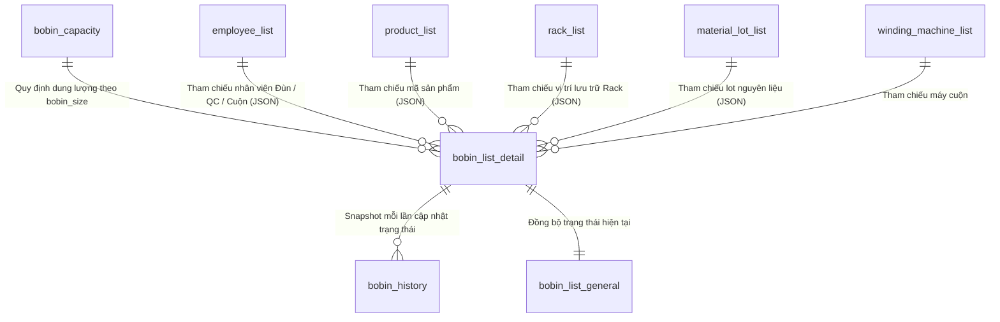

# DATABASE_SCHEMA.md - Thiết Kế Cơ Sở Dữ Liệu Chi Tiết

Tài liệu mô tả chi tiết tất cả các bảng (tables), cấu trúc cột (columns), kiểu dữ liệu, quan hệ (relationships) và các quy chuẩn lưu trữ JSON trong cơ sở dữ liệu `production_db` của hệ thống **WEB_BOBIN**.

---

## 1. Sơ Đồ Quan Hệ Thực Thể (ERD Overview)



---

## 2. Chi Tiết Các Bảng Dữ Liệu Chính

### 2.1. Bảng `bobin_list_detail` (Bảng Chi Tiết Bobin Hiện Tại)
Bảng lưu trữ thông tin trạng thái hoạt động hiện thời của từng Bobin trong xưởng. Mỗi Bobin có một dòng duy nhất theo `bobin_identification_code`.

| Tên Cột | Kiểu Dữ Liệu | Nullable | Mô Tả / Ghi Chú Nghiệp Vụ |
| :--- | :--- | :--- | :--- |
| `id` | `INT(11)` | NO | Khóa chính (Auto Increment). |
| `bobin_key_code` | `VARCHAR(50)` | NO | Mã khóa duy nhất: `[Mã_định_danh]_[Y_m_d_H_i_s]` (ví dụ `A0001_2026_10_04_18_29_44`). |
| `bobin_identification_code` | `VARCHAR(50)` | NO | Mã định danh vật lý của Bobin (ví dụ `A0001`, `B0020`). |
| `bobin_size` | `ENUM` | NO | Kích thước Bobin: `'PL7-3'`, `'PL4-7 (TU04.TU06)'`, `'PL4-7 (TU08~)'`. |
| `bobin_type` | `ENUM` | NO | Loại Bobin: `'Sản xuất'`, `'Bù'`, các loại điều chỉnh ngoại quan (`Gel`, `Dị vật`, `Trầy`, `Biến dạng`, `Xước`, `Chữ in`, `Vón cục`, `Màu`), hoặc `'Điều chỉnh (Do CP)'`. |
| `extrusion_employee` | `TEXT (JSON)` | YES | Thông tin NV đùn: `{"employee_code": "02619486", "employee_name": "Nguyễn Văn A"}`. |
| `extrusion_check` | `LONGTEXT (JSON)` | YES | Kết quả Đùn Check 5 tiêu chuẩn: `{"diameter": true, "gel": true, "foreign_object": true, "color": true, "print": true}`. |
| `rack` | `LONGTEXT (JSON)` | YES | Thông tin vị trí lưu trữ: `{"code": "Rack_B021_01"}`. |
| `products` | `TEXT (JSON)` | YES | Thông tin sản phẩm: `{"production_order_code": "PO123", "product_code": "PROD456"}`. |
| `material_lot` | `TEXT (JSON)` | YES | Lô nguyên vật liệu: `{"lot": "MAT_LOT_99"}`. |
| `print_lot` | `VARCHAR(50)` | YES | Lô in dập trên dây/bobin. |
| `length_m` | `DECIMAL(10,3)` | YES | Chiều dài đo đạc (mét). |
| `shift` | `ENUM` | YES | Ca làm việc: `'Ca 1'`, `'Ca 2'`, `'Ca 3'`, `'Hành chính'`. |
| `extrusion_date` | `DATE` | YES | Ngày thực hiện đùn (`Y-m-d`). |
| `finish_time` | `DATETIME` | YES | Thời điểm hoàn thành công đoạn đùn / cuộn (`Y-m-d H:i:s`). |
| `bobin_current_status` | `ENUM` | YES | Trạng thái hiện tại: `'Rolled'`, `'Busy_Unchecked'`, `'Busy_Checked'`, `'Pending_Cancellation'`, `'Cancelled'`. |
| `visual_inspection` | `TEXT (JSON)` | YES | Kết quả QC: `{"inspector_code": "NVQC01", "inspector_name": "Trần B", "inspection_time": "...", "defects": {"gel": false, "foreign_object": false, "color_issue": false, "print_quality": false, "note": "..."}}`. |
| `winding_machine` | `VARCHAR(50)` | YES | Mã máy cuộn thực hiện. |
| `winding_employee` | `TEXT (JSON)` | YES | Thông tin NV cuộn: `{"employee_code": "NVC01", "employee_name": "Lê C"}`. |
| `flow_test_result` | `ENUM` | YES | Kết quả test thông khí công đoạn cuộn: `'Thành công'`, `'Thất bại'`. |
| `winding_note` | `VARCHAR(100)` | YES | Ghi chú từ nhóm cuộn. |
| `update_history` | `LONGTEXT (JSON)` | YES | Mảng JSON lưu vết lịch sử điều chỉnh: `[{"stage": "extrusion|qc|winding", "action": "edit", "employee_code": "...", "employee_name": "...", "updated_at": "YYYY-MM-DD HH:mm:ss", "note": "..."}]`. |
| `updated_time` | `DATETIME` | YES | Thời điểm cập nhật trạng thái gần nhất. **LƯU Ý:** Không thay đổi khi nhân viên đùn chỉ chỉnh sửa thông tin. |

---

### 2.2. Bảng `bobin_history` (Nhật Ký Lịch Sử Luân Chuyển Bobin)
Lưu trữ toàn bộ các phiên bản trạng thái liên tục trong vòng đời Bobin. Dùng để tra cứu lịch sử, kiểm toán và thống kê KPI sản xuất.

- **Cấu trúc:** Tương đồng với bảng `bobin_list_detail` (gồm đầy đủ các cột thông tin từ `bobin_key_code`, `bobin_identification_code`, `extrusion_check`, `rack`, `products`, `visual_inspection`, `winding_*`, `updated_time`).
- **Quy tắc ghi dữ liệu:**
  - Khi đùn tạo mới $\rightarrow$ `INSERT` bản ghi lịch sử đầu tiên (`Busy_Unchecked`).
  - Khi QC xác nhận $\rightarrow$ `INSERT` bản ghi trạng thái mới (`Busy_Checked`).
  - Khi Cuộn xác nhận $\rightarrow$ `INSERT` bản ghi hoàn thành (`Rolled`).
  - Khi báo hủy / hủy $\rightarrow$ `INSERT` bản ghi (`Pending_Cancellation` / `Cancelled`).
  - **QUY TẮC ĐẶC BIỆT (Req VI & VII):** Khi nhân viên Đùn **chỉnh sửa** thông tin qua trang `extrusionEditBobin`:
    - **KHÔNG ĐƯỢC INSERT DÒNG MỚI.**
    - Tìm đến bản ghi có `bobin_key_code` tương ứng và thực hiện `UPDATE` các trường đùn (`products`, `rack`, `extrusion_check`, `print_lot`,...).
    - Giữ nguyên giá trị `updated_time` ban đầu của bản ghi.

---

### 2.3. Bảng `bobin_list_general` (Danh Mục Tổng Hợp Trạng Thái)
Bảng rút gọn theo dõi trạng thái nhanh của Bobin.

| Tên Cột | Kiểu Dữ Liệu | Nullable | Mô Tả |
| :--- | :--- | :--- | :--- |
| `id` | `INT(11)` | NO | Khóa chính. |
| `bobin_key_code` | `VARCHAR(50)` | NO | Mã khóa Bobin. |
| `bobin_identification_code` | `VARCHAR(50)` | NO | Mã định danh Bobin. |
| `bobin_size` | `ENUM` | NO | Kích thước Bobin. |
| `bobin_type` | `ENUM` | NO | Loại Bobin. |
| `bobin_current_status` | `ENUM` | YES | Trạng thái hiện tại. |
| `updated_time` | `TIMESTAMP` | NO | Thời điểm cập nhật. |

---

### 2.4. Bảng `employee_list` (Quản Lý Nhân Viên & Phân Quyền)

| Tên Cột | Kiểu Dữ Liệu | Nullable | Mặc Định | Mô Tả |
| :--- | :--- | :--- | :--- | :--- |
| `id` | `INT(11)` | NO | Auto Increment | Khóa chính. |
| `employee_code` | `VARCHAR(50)` | NO | | Mã định danh nhân viên (Unique cá nhân trong xưởng). |
| `employee_name` | `VARCHAR(100)` | NO | | Họ và tên đầy đủ. |
| `username` | `VARCHAR(50)` | NO | | Tên đăng nhập (mặc định trùng với `employee_code`). |
| `password` | `VARCHAR(255)` | NO | | Mật khẩu đã băm (`PASSWORD_DEFAULT`, mặc định khởi tạo là `123`). |
| `role` | `ENUM` | NO | `'extrusion'` | Vai trò: `'extrusion'`, `'qc'`, `'winding'`, `'admin'`. |
| `is_active` | `TINYINT(1)` | NO | `1` | Trạng thái: `1` (Đang làm việc), `0` (Đã nghỉ/Khóa). |
| `is_first_login` | `TINYINT(1)` | NO | `1` | `1` = Bắt buộc đổi mật khẩu khi đăng nhập lần đầu. |
| `created_at` | `TIMESTAMP` | NO | `CURRENT_TIMESTAMP` | Thời điểm tạo tài khoản. |
| `updated_at` | `TIMESTAMP` | NO | `CURRENT_TIMESTAMP ON UPDATE` | Thời điểm cập nhật cuối. |

---

### 2.5. Bảng `bobin_capacity` (Giới Hạn Sức Chứa Theo Kích Thước)
Quy định sức chứa tối đa của các loại Bobin trong xưởng phục vụ việc phân trang và giới hạn hiển thị:
- `PL7-3`: 460 Bobin.
- `PL4-7 (TU08~)`: 630 Bobin.
- `PL4-7 (TU04.TU06)`: 630 Bobin.

---

### 2.6. Các Bảng Danh Mục Phụ Trợ (Master Lookup Tables)
- `product_list`: `(id, product_code, production_order_code, description,...)` - Danh mục sản phẩm và PO.
- `rack_list`: `(id, rack_code, workshop, floor,...)` - Danh mục giá kệ (Rack). Quy chuẩn đặt tên: `Rack_B021_01` (Xưởng 2, Tầng 1, Kệ 01).
- `material_lot_list` & `material_list`: Danh mục các lô vật liệu nhựa đầu vào.
- `winding_machine_list`: Danh mục máy cuộn (`MC01`, `MC02`,...).
- `extrusion_machine_list`: Danh mục máy đùn (`MD01`, `MD02`,...).
- `day_list`, `month_list`, `year_list`: Bảng tra cứu ngày/tháng/năm hệ thống.

---

## 3. Quy Chuẩn Dữ Liệu JSON (JSON Schemas)

Nhiều cột dữ liệu phức tạp được lưu trữ dưới dạng JSON UTF-8 trong MySQL/MariaDB để tăng tính linh hoạt:

1. **`extrusion_check`:**
   ```json
   {
     "diameter": true,
     "gel": true,
     "foreign_object": true,
     "color": true,
     "print": true
   }
   ```
   *(Tất cả `true` nghĩa là đạt tiêu chuẩn Đùn Check).*

2. **`visual_inspection`:**
   ```json
   {
     "inspector_code": "02619486",
     "inspector_name": "Nguyễn Văn QC",
     "inspection_time": "2026-10-04 19:30:00",
     "defects": {
       "gel": false,
       "foreign_object": false,
       "color_issue": false,
       "print_quality": false,
       "note": "Ngoại quan đẹp, không lỗi"
     }
   }
   ```

3. **`rack`:**
   ```json
   {
     "code": "Rack_B021_05"
   }
   ```